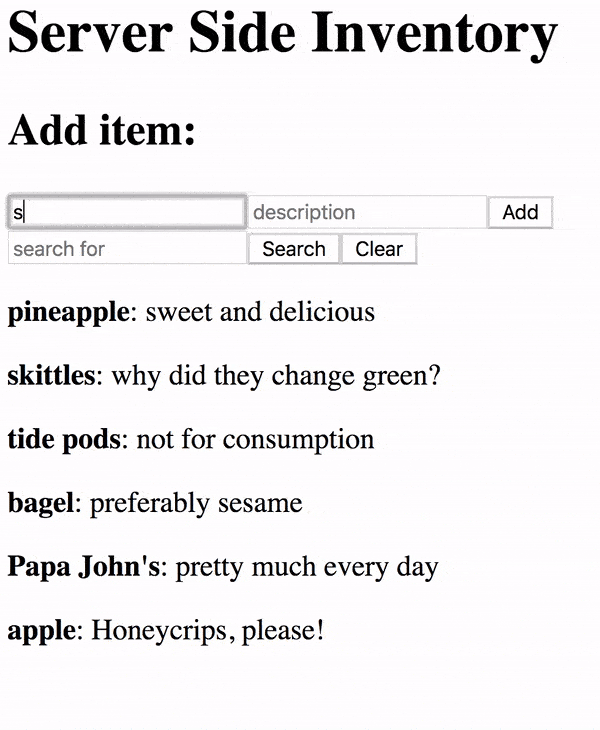

Server Side Inventory
==
Tech: JQuery, Node, Express, AJAX
---
In this project we'll create a project that tracks an inventory on the server. 

Base Mode:
==

The project will allow users to view items in the inventory, add items to the inventory, and search for items by name. Inventory items will be objects that are held in a server side array.

In your `server.js` handle each of the routes which will be hit via AJAX as follows:

- `/inventory`: GET, returns the full array of inventory
- `/inventory`: POST, receives a new object, adds it to the existing inventory

Example, with search:

Stretch Goals:
==

Add the following features:
- clear appropriate input(s) on successful add
- `/search`: POST, receives a string that we'll check against existing objects in the inventory & returns an array of matches (hint: research the  STRING.includes JS method)
- clear appropriate search input(s) on search completion
- add search functionality for description
- display "no matches" if empty array is returned for a search
- "remove" button for each item that makes use of a DELETE route 
